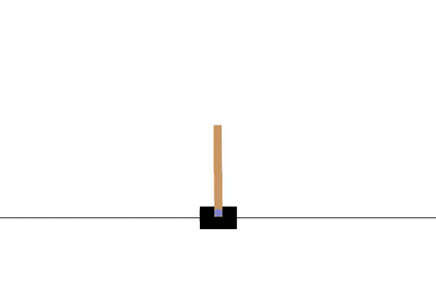

# PPO CartPole

## Video



Video minh họa một episode đánh giá trong môi trường CartPole-v1. Policy PPO quan sát vị trí và vận tốc của xe, góc và vận tốc góc của thanh, rồi liên tục chọn lực đẩy sang trái hoặc sang phải để giữ thanh thăng bằng. Video được ghi từ policy sau 100.000 timestep huấn luyện.

## Cấu hình PPO

| Tham số | Giá trị | Lý do lựa chọn |
|---|---:|---|
| `policy` | `MlpPolicy` | Observation của CartPole là vector bốn chiều nên mạng fully connected đáp ứng đúng dạng dữ liệu đầu vào. |
| `total_timesteps` | `100000` | Cung cấp nhiều chu kỳ rollout và cập nhật trong khi thời gian chạy trên CPU vẫn ở quy mô của một bài thực hành. |
| `learning_rate` | `3e-4` | Giá trị mặc định của PPO trong Stable-Baselines3; được giữ cố định để giới hạn số tham số cần khảo sát. |
| `n_steps` | `1024` | Mỗi rollout chứa đủ transition để tính GAE trên nhiều episode, đồng thời nhỏ hơn cấu hình mặc định `2048` để cập nhật thường xuyên hơn. |
| `batch_size` | `64` | `1024` chia hết cho `64`, do đó mỗi epoch gồm 16 mini-batch đầy đủ. |
| `n_epochs` | `10` | Mỗi rollout được dùng qua 10 lượt cập nhật, bằng cấu hình mặc định của Stable-Baselines3 PPO. |
| `gamma` | `0.99` | Reward trong tương lai giảm chậm, phù hợp với mục tiêu giữ thanh thăng bằng trong nhiều timestep liên tiếp. |
| `gae_lambda` | `0.95` | Giá trị mặc định của Stable-Baselines3, nằm giữa TD một bước và ước lượng gần Monte Carlo. |
| `clip_range` | `0.2` | Probability ratio được clip quanh 1 trong khoảng `[0.8, 1.2]`, theo cấu hình PPO-Clip mặc định. |
| `ent_coef` | `0.0` | Không thêm entropy bonus; mức ngẫu nhiên đến từ phân phối action của policy trong quá trình thu rollout. |
| `vf_coef` | `0.5` | Đặt trọng số value loss bằng một nửa trong objective tổng, theo cấu hình mặc định của thư viện. |
| `max_grad_norm` | `0.5` | Giới hạn norm của gradient để giảm các bước cập nhật có độ lớn bất thường. |
| `seed` | `42` | Cố định lần chạy mặc định để có thể lặp lại cùng cấu hình; đánh giá cuối vẫn cần nhiều seed nếu dùng để so sánh. |

## Kết quả

Sau huấn luyện:

```text
models/ppo_cartpole.zip          mô hình cuối
models/best/best_model.zip       mô hình có mean return đánh giá cao nhất
logs/train/monitor.csv           return và độ dài từng episode
logs/eval/evaluations.npz        kết quả đánh giá định kỳ
outputs/training_config.json     cấu hình huấn luyện
outputs/training_curve.png       đường cong return
outputs/training_curve.csv       dữ liệu của đường cong
```

Sau đánh giá:

```text
outputs/evaluation_summary.json  mean, standard deviation, min và max return
outputs/evaluation_episodes.csv  return và độ dài của từng episode
videos/ppo-cartpole-episode-0.mp4 video của episode được ghi lại
```

## Nguồn kỹ thuật

- [Proximal Policy Optimization Algorithms](https://arxiv.org/abs/1707.06347)
- [Stable-Baselines3 PPO](https://stable-baselines3.readthedocs.io/en/master/modules/ppo.html)
- [Gymnasium CartPole](https://gymnasium.farama.org/environments/classic_control/cart_pole/)
