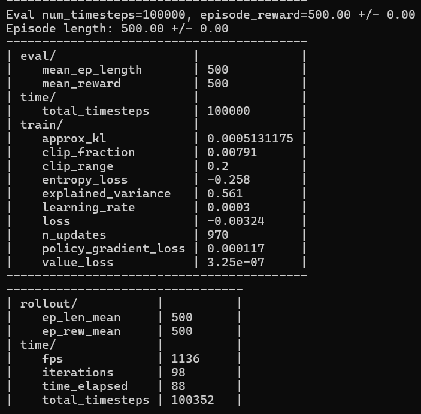
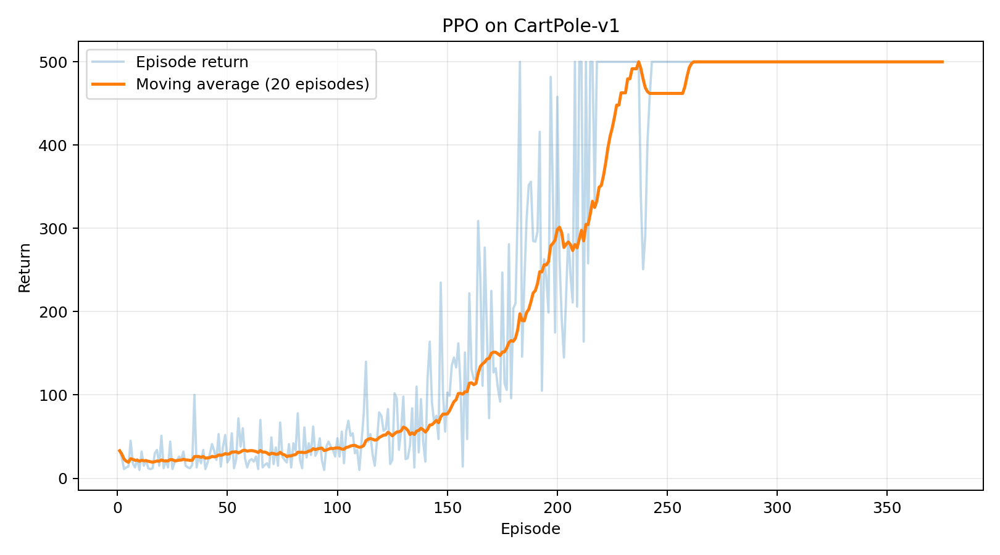
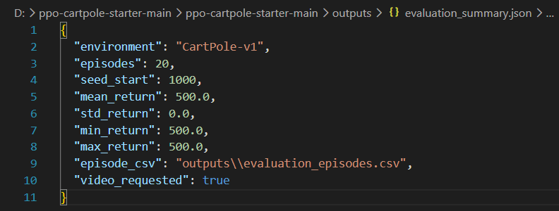

# PPO CartPole

## Video

Video minh họa một episode đánh giá trong môi trường CartPole-v1. Policy PPO quan sát vị trí và vận tốc của xe, góc và vận tốc góc của thanh, rồi liên tục chọn lực đẩy sang trái hoặc sang phải để giữ thanh thăng bằng. Video được ghi từ policy sau 100.000 timestep huấn luyện.

## Cấu hình PPO

| Tham số | Giá trị | Lý do lựa chọn |
|---|---:|---|
| `policy` | `MlpPolicy` | Observation của CartPole là vector bốn chiều nên mạng fully connected đáp ứng đúng dạng dữ liệu đầu vào. |
| `total_timesteps` | `100000` | Cung cấp nhiều chu kỳ rollout và cập nhật trong khi thời gian chạy trên CPU vẫn ở quy mô của một bài thực hành. |
| `learning_rate` | `3e-4` | Giá trị mặc định của PPO trong Stable-Baselines3; được giữ cố định để giới hạn số tham số cần khảo sát. |
| `n_steps` | `1024` | Mỗi rollout chứa đủ transition để tính GAE trên nhiều episode, đồng thời nhỏ hơn cấu hình mặc định `2048` để cập nhật thường xuyên hơn. |
| `batch_size` | `64` | `1024` chia hết cho `64`, do đó mỗi epoch gồm 16 mini-batch đầy đủ. |
| `n_epochs` | `10` | Mỗi rollout được dùng qua 10 lượt cập nhật, bằng cấu hình mặc định của Stable-Baselines3 PPO. |
| `gamma` | `0.99` | Reward trong tương lai giảm chậm, phù hợp với mục tiêu giữ thanh thăng bằng trong nhiều timestep liên tiếp. |
| `gae_lambda` | `0.95` | Giá trị mặc định của Stable-Baselines3, nằm giữa TD một bước và ước lượng gần Monte Carlo. |
| `clip_range` | `0.2` | Probability ratio được clip quanh 1 trong khoảng `[0.8, 1.2]`, theo cấu hình PPO-Clip mặc định. |
| `ent_coef` | `0.0` | Không thêm entropy bonus; mức ngẫu nhiên đến từ phân phối action của policy trong quá trình thu rollout. |
| `vf_coef` | `0.5` | Đặt trọng số value loss bằng một nửa trong objective tổng, theo cấu hình mặc định của thư viện. |
| `max_grad_norm` | `0.5` | Giới hạn norm của gradient để giảm các bước cập nhật có độ lớn bất thường. |
| `seed` | `42` | Cố định lần chạy mặc định để có thể lặp lại cùng cấu hình; đánh giá cuối vẫn cần nhiều seed nếu dùng để so sánh. |

## Kết quả

Kết quả cuối quá trình huấn luyện cho thấy mean reward và mean episode length đều đạt 500. CartPole-v1 giới hạn mỗi episode ở 500 timestep, nên các lần đánh giá định kỳ tại thời điểm này đã đi đến giới hạn của episode. Giá trị `total_timesteps` cuối là 100352 thay vì đúng 100000 vì PPO thu thập theo từng rollout gồm 1024 timestep; rollout cuối phải được thu thập trọn vẹn trước khi cập nhật.

Đường xanh nhạt là return của từng episode nên dao động rõ trong giai đoạn policy đang học. Đường cam là moving average trên 20 episode, cho thấy return tăng dần và đạt 500 ở phần cuối. Đoạn nằm ngang tại 500 biểu thị các episode huấn luyện liên tiếp đã chạm giới hạn thời lượng của môi trường trong lần chạy này.

Mô hình được đánh giá trên 20 episode bắt đầu từ seed 1000. Mean, min và max return đều bằng 500, còn standard deviation bằng 0, nghĩa là cả 20 episode của lần đánh giá đều đạt 500 timestep. Kết quả này xác nhận policy chạy ổn định trên tập episode đã đánh giá; nó không thay thế việc thử thêm nhiều seed huấn luyện khi cần so sánh thuật toán.

## Nguồn kỹ thuật

- [Proximal Policy Optimization Algorithms](https://arxiv.org/abs/1707.06347)
- [Stable-Baselines3 PPO](https://stable-baselines3.readthedocs.io/en/master/modules/ppo.html)
- [Gymnasium CartPole](https://gymnasium.farama.org/environments/classic_control/cart_pole/)
